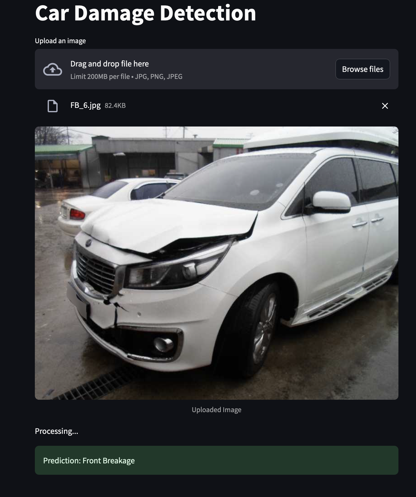

# 🚗 Car Damage Detection App

A simple and interactive **Streamlit web app** that classifies uploaded car images as *damaged* or *normal* using a trained **PyTorch deep learning model**.

---

## 🧠 Project Overview

This project uses a pretrained **ResNet50** model fine-tuned to detect car damage from images.
The model (`saved_model.pth`) is loaded inside the app, which lets users upload an image and view instant predictions directly in the browser.

---

## 📁 Project Structure

```
streamlit-app/
│
├── app.py                # Main Streamlit web application
├── model_helper.py       # Model loading and prediction logic
├── saved_model.pth       # Trained PyTorch model (binary file)
├── requirements.txt      # List of Python dependencies
└── README.md             # Project documentation (this file)
```

---

## ⚙️ Setup Instructions

### 1️⃣ Clone or download the repository

```bash
git clone <your-repo-url>
cd streamlit-app
```

### 2️⃣ Create and activate a virtual environment

```bash
python3 -m venv venv
source venv/bin/activate   # On macOS/Linux
venv\Scripts\activate      # On Windows
```

### 3️⃣ Install dependencies

```bash
pip install -r requirements.txt
```

If you don’t have `requirements.txt`, install manually:

```bash
pip install streamlit torch torchvision pillow
```

---

## 🚀 Run the App

Start the Streamlit server:

```bash
streamlit run app.py
```

Then open the provided local URL (typically `http://localhost:8501`) in your browser.

---

## 🖼️ How It Works

1. Upload a car image (`.jpg`, `.jpeg`, or `.png`)
2. The model processes the image
3. The app displays:

   * The uploaded image
   * The predicted label (e.g., *Front Normal*, *Rear Damage*, etc.)

---

## 🧩 Model Details

* **Architecture:** ResNet50 (transfer learning)
* **Framework:** PyTorch
* **Input:** RGB image resized to 224×224
* **Output:** One of several car damage categories

---

## 🧪 Example Usage

Upload an image like this:



The app will output something like:

```
Prediction: Front Crushed
```

---

## 🧰 Troubleshooting

* **FileNotFoundError:** Ensure `saved_model.pth` is inside the same directory as `model_helper.py`.
* **ModuleNotFoundError:** Verify your virtual environment is activated.
* **Streamlit version warning:** Replace `use_column_width` with `use_container_width` in `st.image()`.

---

## ✨ Future Improvements

* Add confidence scores for predictions
* Improve UI with Streamlit components
* Deploy app on Streamlit Cloud or Hugging Face Spaces

---

## 🧑‍💻 Author

**Tannu Nirupam**
📧 [https://github.com/TannuNirupam]

---
